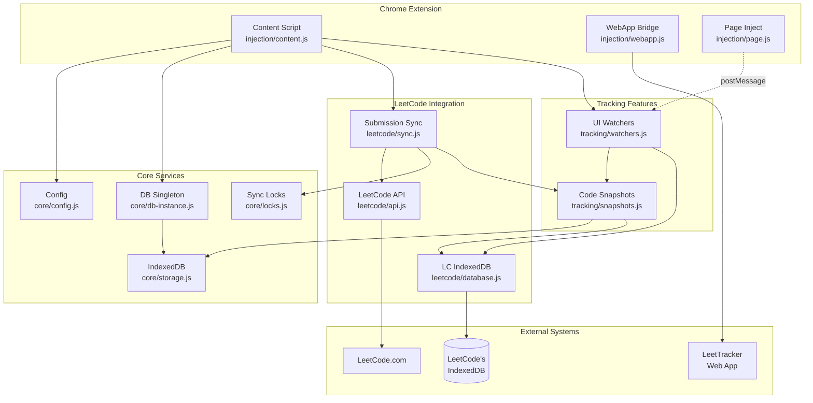
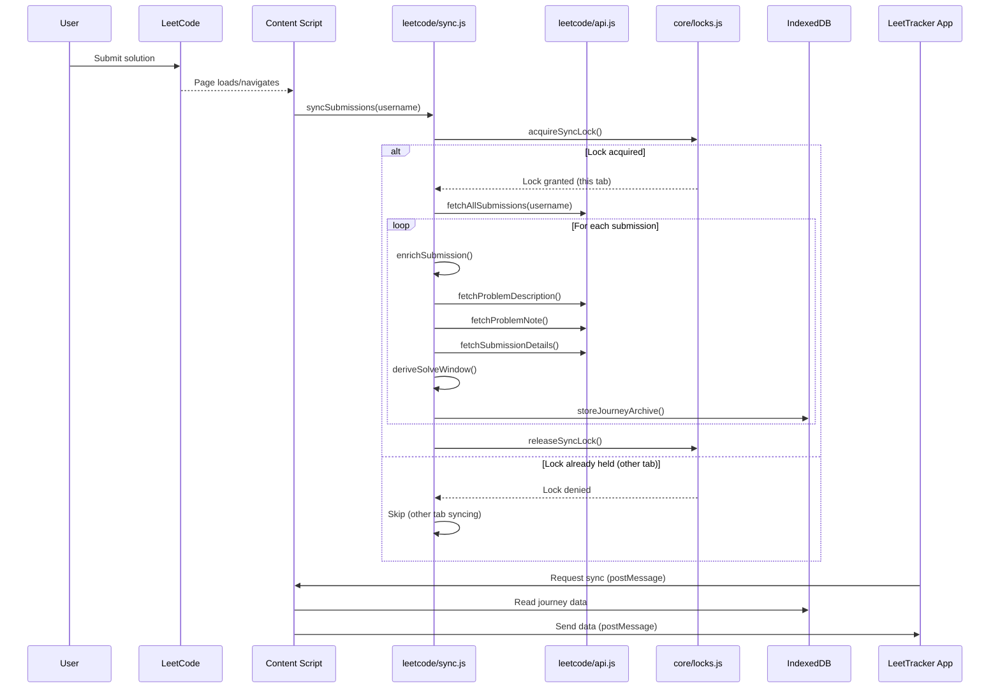
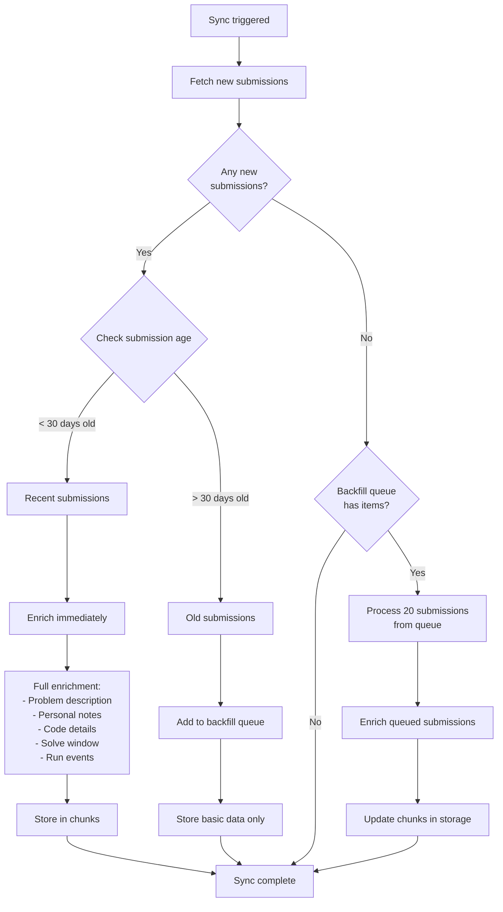
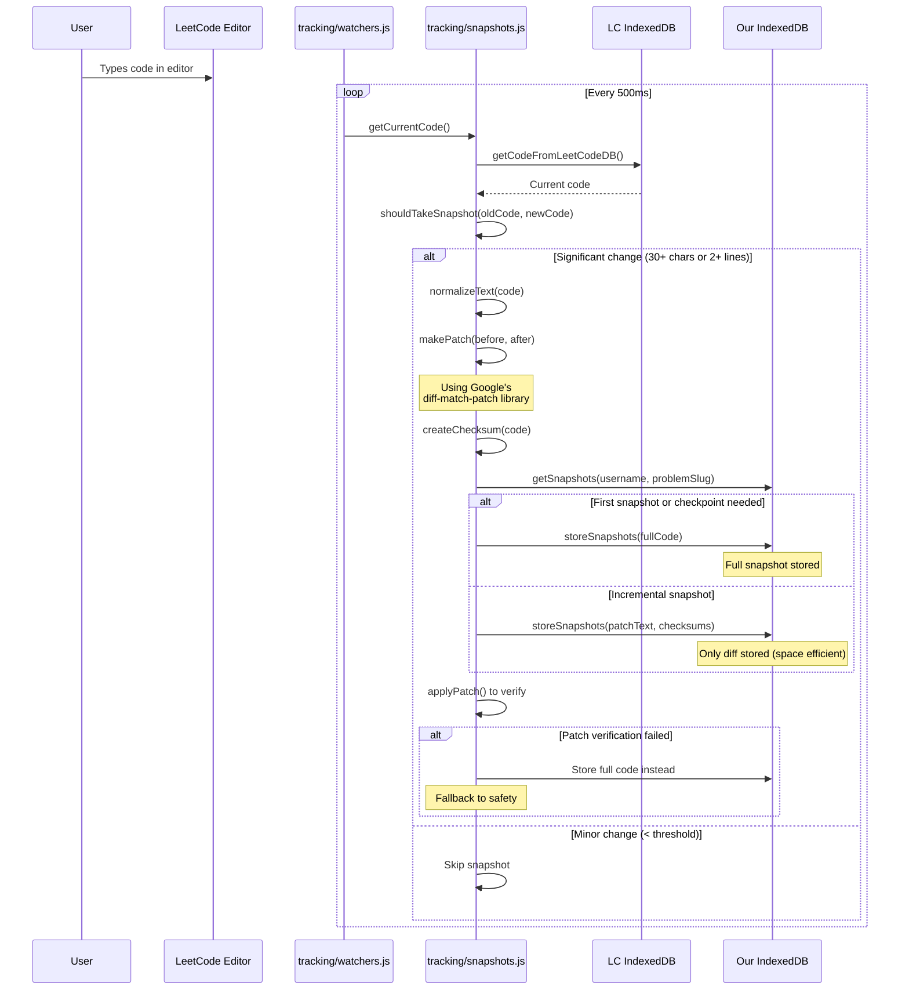
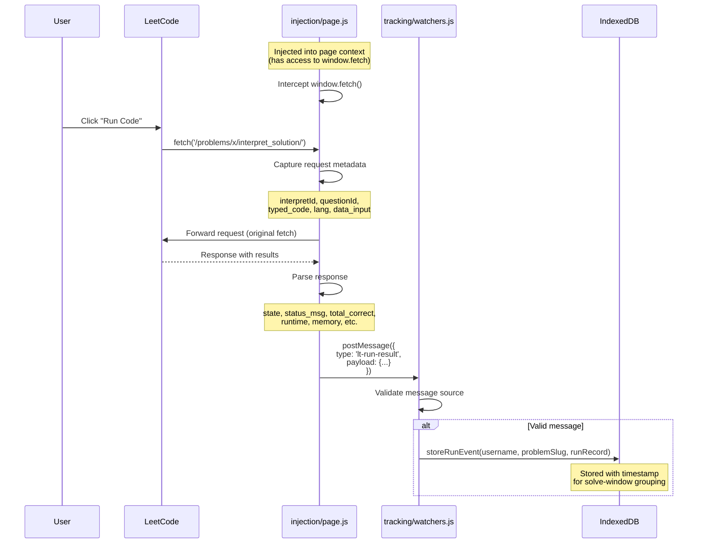
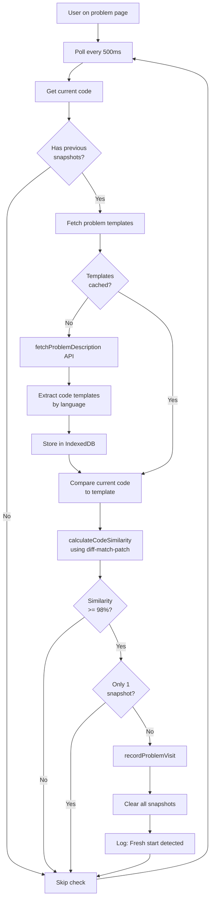
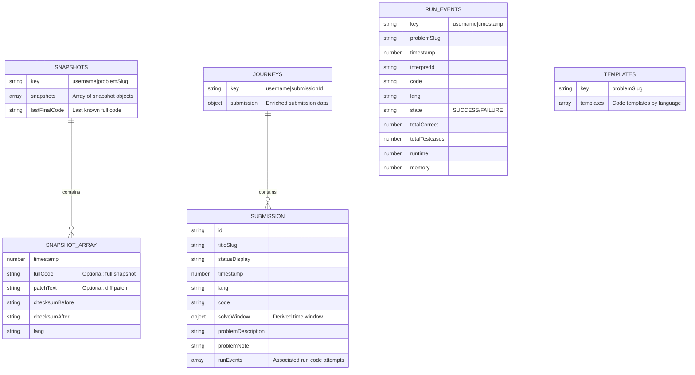
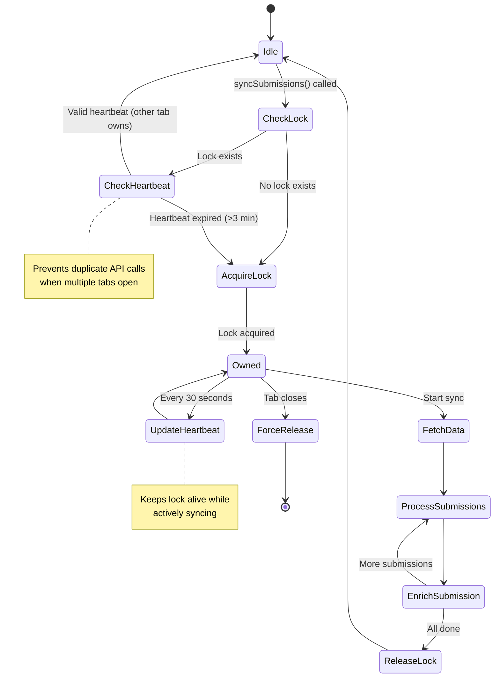
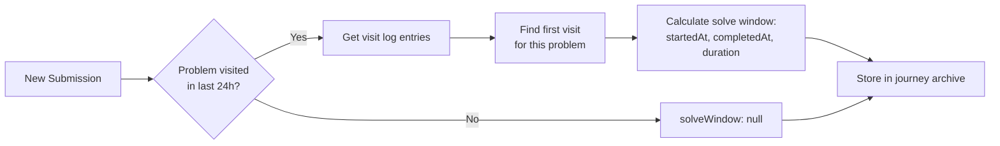
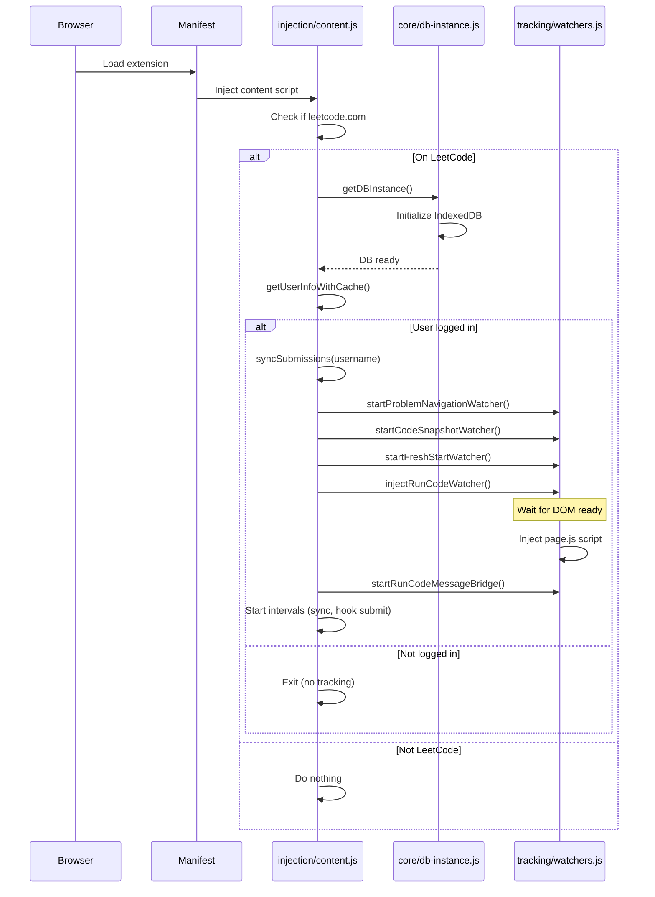

# LeetTracker Extension Architecture

## Overview

LeetTracker is a Chrome extension that automatically tracks your LeetCode problem-solving journey by capturing submissions, creating code snapshots, and organizing your progress for analysis in a web app.

---

## Table of Contents

1. [High-Level Architecture](#high-level-architecture)
2. [Module Organization](#module-organization)
3. [Data Flow](#data-flow)
4. [Key Processes](#key-processes)
5. [Storage Strategy](#storage-strategy)
6. [Synchronization System](#synchronization-system)
7. [Design Decisions](#design-decisions)

---

## High-Level Architecture



**Key Design Decision**: Modular architecture with clear separation of concerns:
- **Injection Layer**: Handles Chrome extension contexts (content script, page script, webapp bridge)
- **Core Layer**: Reusable utilities (config, storage, locks, singleton DB)
- **Integration Layer**: LeetCode-specific APIs and data access
- **Tracking Layer**: Feature-specific logic (snapshots, watchers)

---

## Module Organization

### File Structure

```
src/
├── core/                    # Reusable infrastructure
│   ├── config.js           # Constants, keys, Chrome storage wrapper
│   ├── storage.js          # IndexedDB wrapper (snapshots, journeys, runs)
│   ├── locks.js            # Cross-tab sync locking with heartbeat
│   └── db-instance.js      # Singleton pattern for DB access
│
├── leetcode/               # LeetCode platform integration
│   ├── api.js              # GraphQL & REST API calls with retry logic
│   ├── database.js         # Access to LeetCode's own IndexedDB
│   └── sync.js             # Submission fetching & enrichment orchestrator
│
├── tracking/               # User activity tracking
│   ├── snapshots.js        # Code snapshot system with diff/patch
│   └── watchers.js         # UI observers (submit button, navigation, run code)
│
└── injection/              # Chrome extension entry points
    ├── content.js          # Main content script (runs on leetcode.com)
    ├── webapp.js           # Bridge to LeetTracker web app
    └── page.js             # Injected into page context (intercepts fetch)
```

**Key Design Decision**: Grouped by feature/responsibility instead of flat structure. Makes it easy to:
- Find related code quickly
- Understand dependencies (imports show layer boundaries)
- Scale as features grow
- Test modules in isolation

---

## Data Flow

### 1. Submission Sync Flow



**Key Design Decisions**:
- **Cross-tab locking**: Prevents duplicate API calls when multiple LeetCode tabs are open
- **Heartbeat mechanism**: Lock expires after 3 minutes of inactivity (handles crashed tabs)
- **Incremental sync**: Only fetches new submissions, caches manifest of synced IDs
- **Backfill queue**: Older submissions (>30 days) queued for lazy enrichment instead of processed immediately
- **Batch processing**: Backfill processes 20 submissions per sync to avoid blocking
- **Enrichment pipeline**: Adds problem descriptions, notes, and solve-window metadata
- **Session ID**: Each tab has unique ID for lock ownership tracking

---

### Backfill Queue System

To prevent slow initial syncs for users with many historical submissions, the extension uses a two-tier sync strategy:



**Key Design Decisions**:
- **30-day cutoff**: Submissions older than 30 days are queued for backfill (balances UX vs performance)
- **Immediate storage**: Old submissions still stored with basic data (id, titleSlug, timestamp)
- **Lazy enrichment**: Queue processed only when no new submissions detected (prioritizes fresh data)
- **Batch size**: Processes 20 submissions per backfill run (prevents blocking, maintains heartbeat)
- **FIFO processing**: Oldest submissions enriched first (queue is reversed before storage)
- **Chunk-aware**: Backfill tracks which chunk each submission belongs to for efficient updates
- **Persistent queue**: Stored in Chrome storage, survives browser restarts
- **Heartbeat protected**: Each backfill item updates heartbeat to maintain lock

**Example Timeline**:
- User with 500 submissions syncs for first time
- Submissions from last 30 days (e.g., 50) enriched immediately → ~30-60 seconds
- Remaining 450 queued for backfill, stored with basic data
- User submits a new solution → sync runs, processes new submission only
- User visits LeetCode later (no new submissions) → sync processes 20 from backfill queue
- After ~23 "idle" syncs, all historical data is enriched
- User sees recent data instantly, historical data fills in during idle times

---

### 2. Code Snapshot Flow



**Key Design Decisions**:
- **Diff-based storage**: Stores only changes (patches) to save space, falls back to full snapshots every N changes
- **Checksum validation**: Ensures patches can be applied correctly before storing
- **Threshold filtering**: Avoids spam snapshots for small typos (30 chars or 2 lines changed)
- **Template detection**: Recognizes when user resets to starter code ("Fresh Start" feature)
- **Lock-protected**: Uses `withSnapshotLock()` to prevent race conditions during read-modify-write
- **Best-effort code retrieval**: Tries LeetCode's IndexedDB first, falls back to DOM scraping

---

### 3. Run Code Tracking Flow



**Key Design Decisions**:
- **Page context injection**: Only way to intercept `window.fetch` (content scripts can't)
- **postMessage communication**: Bridges page context → content script securely
- **Source validation**: Checks `event.source === window` and `source === "leettracker"`
- **Code capture**: Stores exact code that was run (from request body), not editor state
- **Metadata preservation**: Captures test input, results, runtime, memory for analysis
- **Timestamp tracking**: Groups run events with submissions in same "solve window"

---

### 4. Fresh Start Detection Flow



**Key Design Decisions**:
- **Template caching**: Fetches problem starter code once, caches in IndexedDB (avoids API spam)
- **98% similarity threshold**: Allows minor whitespace differences, catches actual resets
- **Minimum 2 snapshots**: Don't treat first snapshot as "reset" (user just started)
- **Visit recording**: Updates solve-window tracking when fresh start detected
- **Non-blocking**: Runs asynchronously, doesn't interrupt user experience
- **Language-aware**: Compares against template for user's current language

---

## Storage Strategy

### IndexedDB Schema (Our Extension)



**Key Design Decisions**:
- **Composite keys**: `username|problemSlug` allows multi-user data in same browser
- **Sparse snapshots**: Only store full code at checkpoints, patches in between (space efficient)
- **Denormalized journeys**: Each submission is self-contained (no joins needed)
- **Run event grouping**: Stored separately, linked to submissions via timestamp windows
- **Template caching**: Avoids repeated API calls for same problem

### Chrome Storage (chrome.storage.local)

```javascript
{
  // Sync state
  "leettracker_sync_lock": {
    owner: "session-abc123",
    timestamp: 1699123456789,
    heartbeat: 1699123466789
  },
  
  // Problem ID mapping cache
  "leettracker_problem_id_map": {
    "two-sum": "1",
    "add-two-numbers": "2",
    // ... slug -> questionId mapping
  },
  
  // Visit log for solve windows
  "leettracker_problem_visit_log_username123": [
    { slug: "two-sum", ts: 1699123400 },
    { slug: "add-two-numbers", ts: 1699123500 }
    // Last 24 hours only
  ],
  
  // Sync manifest (which submissions already processed)
  "leettracker_submissions_manifest_username123": {
    lastSync: 1699123456789,
    submissionIds: ["sub1", "sub2", "sub3"]
  }
}
```

**Key Design Decisions**:
- **Chrome storage for small, frequently accessed data**: Faster than IndexedDB for tiny objects
- **IndexedDB for large data**: Better for snapshots, submission details, run events
- **Visit log pruning**: Only keep last 24 hours (determines solve window)
- **Manifest caching**: Tracks which submissions already synced (incremental updates)

---

## Synchronization System

### Cross-Tab Lock Mechanism



**Key Design Decisions**:
- **Session-based ownership**: Each tab has unique session ID (random UUID)
- **Heartbeat mechanism**: Lock owner updates timestamp every 30s during sync
- **Timeout protection**: Lock expires after 3 minutes (handles crashed tabs)
- **Optimistic locking**: Check-then-set pattern with ownership validation
- **Single sync guarantee**: Only one tab syncs at a time, others skip

### Solve Window Derivation



**Key Design Decisions**:
- **Visit-based tracking**: Records when user opens a problem page
- **24-hour window**: Only considers visits in last day (prevents stale data)
- **First visit wins**: Start time is earliest visit for that problem
- **Completion time**: Submission timestamp marks end of solve window
- **Nullable**: If no visits recorded, solveWindow is null (partial data ok)

---

## Key Processes

### Overview

The extension runs several concurrent processes to track your LeetCode activity:

| Process | Purpose | Trigger | Frequency |
|---------|---------|---------|-----------|
| **Extension Initialization** | Sets up database, watchers, and sync on page load | Page load on leetcode.com | Once per page load |
| **Submission Sync** | Fetches and enriches new submissions from LeetCode API | Page load, navigation, interval | Every 5 minutes + on navigation |
| **Backfill Queue Processing** | Enriches older (>30 day) submissions during idle time | When no new submissions found | During idle syncs only |
| **Code Snapshot Watcher** | Captures code changes with diff-based patches | Editor content changes | Every 500ms (when significant change) |
| **Fresh Start Detector** | Detects when user resets to starter code | Editor content changes | Every 500ms (polling) |
| **Problem Navigation Watcher** | Tracks when user visits a problem page | URL changes, DOM mutations | Continuous (MutationObserver) |
| **Submit Button Hook** | Intercepts submission events | Submit button click | Event-driven |
| **Run Code Tracker** | Captures "Run Code" attempts and results | Run Code button click | Event-driven (via page script) |
| **Run Code Message Bridge** | Receives run events from page context | postMessage from page script | Event-driven (message listener) |

**Process Relationships**:
- **Submission Sync** populates the journey archive with historical data
- **Code Snapshot Watcher** captures live coding activity linked to submissions via solve window
- **Fresh Start Detector** clears snapshots when user starts over, updates visit log
- **Problem Navigation Watcher** maintains visit log used by solve window derivation
- **Run Code Tracker** + **Message Bridge** collect attempt data linked to submissions via timestamps
- **Backfill Queue** ensures historical data doesn't slow down initial sync

---

### 1. Extension Initialization



**Key Design Decisions**:
- **Lazy initialization**: Only init DB and watchers if on LeetCode and logged in
- **Singleton DB**: getDBInstance() ensures only one DB connection across all modules
- **DOM ready check**: injectRunCodeWatcher waits for DOMContentLoaded if needed
- **User detection**: Checks LeetCode's own API for login status before starting
- **Interval-based polling**: Checks for submit button every 5s (LeetCode is SPA, button appears dynamically)

### 2. Submission Enrichment Pipeline

```javascript
// Pseudocode for enrichSubmission()
async function enrichSubmission(submission, username) {
  // 1. Basic submission data (already have)
  const enriched = { ...submission };
  
  // 2. Fetch problem description (title, content, difficulty)
  enriched.problemDescription = await fetchProblemDescription(submission.titleSlug);
  
  // 3. Fetch user's personal note for this problem
  enriched.problemNote = await fetchNoteSafe(submission.titleSlug);
  
  // 4. Fetch full submission details (code, runtime, memory)
  if (!enriched.code) {
    const details = await fetchSubmissionDetailsSafe(submission.id);
    enriched.code = details.code;
    enriched.runtime = details.runtime;
    enriched.memory = details.memory;
  }
  
  // 5. Derive solve window from visit log
  enriched.solveWindow = await deriveSolveWindow(username, submission);
  
  // 6. Attach run events from same time period
  if (enriched.solveWindow) {
    enriched.runEvents = await getRunEventsInWindow(
      username,
      submission.titleSlug,
      enriched.solveWindow.startedAt,
      enriched.solveWindow.completedAt
    );
  }
  
  // 7. Fetch code snapshots for this problem
  enriched.snapshots = await getSnapshots(username, submission.titleSlug);
  
  return enriched;
}
```

**Key Design Decisions**:
- **Progressive enhancement**: Each step adds more detail, but failures don't break the whole pipeline
- **Safe wrappers**: `fetchNoteSafe`, `fetchSubmissionDetailsSafe` catch errors and return null
- **Retry logic**: All API calls use exponential backoff (network resilience)
- **Cache where possible**: Problem descriptions cached (same for all users)
- **Conditional fetching**: Only fetch code if not already in initial submission data
- **Temporal linking**: Groups snapshots and run events by solve window timestamps

---

## Design Decisions Summary

### Architecture Decisions

| Decision | Rationale | Trade-off |
|----------|-----------|-----------|
| **ES6 Modules** | Modern, tree-shakeable, IDE support | Required build step (Vite) |
| **Vite Bundler** | Fast builds, great DX, HMR support | More complex than simple concat |
| **Feature-based folders** | Clear organization, scales well | Deeper import paths |
| **Singleton DB pattern** | Ensures single connection, prevents race conditions | Slightly more complex than global |
| **Chrome storage + IndexedDB** | Best of both worlds (fast small data + large data storage) | Two storage APIs to manage |

### Performance Decisions

| Decision | Rationale | Trade-off |
|----------|-----------|-----------|
| **Diff-based snapshots** | 10-100x space savings vs full snapshots | Complexity in reconstruction |
| **Incremental sync** | Only fetches new submissions (fast) | Must maintain manifest state |
| **Threshold filtering** | Prevents snapshot spam from typos | Might miss some granular changes |
| **Cross-tab locking** | Prevents duplicate API calls | Requires heartbeat mechanism |
| **Template caching** | Avoids repeated API calls | Stale if LeetCode updates templates |

### Reliability Decisions

| Decision | Rationale | Trade-off |
|----------|-----------|-----------|
| **Retry with backoff** | Handles transient network failures | Slower on persistent failures |
| **Checksum validation** | Ensures patches apply correctly | Extra computation |
| **Heartbeat timeout** | Recovers from crashed tabs | 3-minute delay before recovery |
| **DOM ready checks** | Prevents race conditions | Adds timing complexity |
| **Multiple code sources** | Falls back if IndexedDB unavailable | More code paths to test |

### User Experience Decisions

| Decision | Rationale | Trade-off |
|----------|-----------|-----------|
| **Background operation** | Non-blocking, doesn't interrupt coding | User may not notice it working |
| **Polling intervals** | Simple, works with LeetCode's SPA | Some CPU usage even when idle |
| **Auto-sync on navigation** | Always up-to-date | More API calls |
| **Visit-based solve windows** | Captures user intent to solve | Requires user to visit problem page |
| **Fresh start detection** | Auto-resets for re-attempts | 98% threshold may have false positives |

---

## Future Improvements

### Potential Enhancements

1. **WebSocket for real-time sync** - Instead of polling, listen for LeetCode events
2. **Service Worker migration** - Manifest V3 compliance (Manifest V2 deprecated 2024)
3. **Diff algorithm optimization** - Custom diff for code (aware of syntax)
4. **Snapshot compression** - Further reduce storage with gzip/lz4
5. **Offline queue** - Queue API calls when offline, sync when online
6. **GraphQL subscription** - Listen to LeetCode's subscription endpoint
7. **Test coverage** - Unit tests for core modules (especially snapshots)
8. **Performance monitoring** - Track snapshot times, sync duration

### Known Limitations

1. **SPA detection**: Relies on polling for UI changes (could miss rapid navigation)
2. **LeetCode API changes**: Tightly coupled to LeetCode's current API shape
3. **Storage limits**: Chrome IndexedDB quota (~10% of disk space)
4. **Single-device sync**: No cloud sync between devices (extension-local only)
5. **Language detection heuristics**: May guess wrong language if ambiguous

---

## Interview Talking Points

### Technical Depth
- **Module system**: ES6 imports, singleton pattern, dependency injection
- **Storage strategy**: Why Chrome storage + IndexedDB hybrid
- **Concurrency**: Cross-tab locking, heartbeat mechanism
- **Data structures**: Diff-based snapshots, temporal linking

### Problem Solving
- **Race conditions**: DOM ready, chrome.runtime init, cross-tab sync
- **Network resilience**: Retry logic, exponential backoff, safe wrappers
- **Space optimization**: Patches vs full snapshots (10-100x savings)
- **Performance**: Threshold filtering, template caching, incremental sync

### User-Centric Design
- **Non-blocking**: All operations async, doesn't interrupt user
- **Reliable**: Checksums, validation, fallbacks
- **Privacy-aware**: All data stored locally in browser
- **Transparent**: Console logging for debugging

### Code Quality
- **Modular**: Clear separation of concerns, single responsibility
- **Documented**: Comments explain "why", not just "what"
- **Consistent**: Naming conventions, error handling patterns
- **Modern**: ES6+, async/await, proper imports
